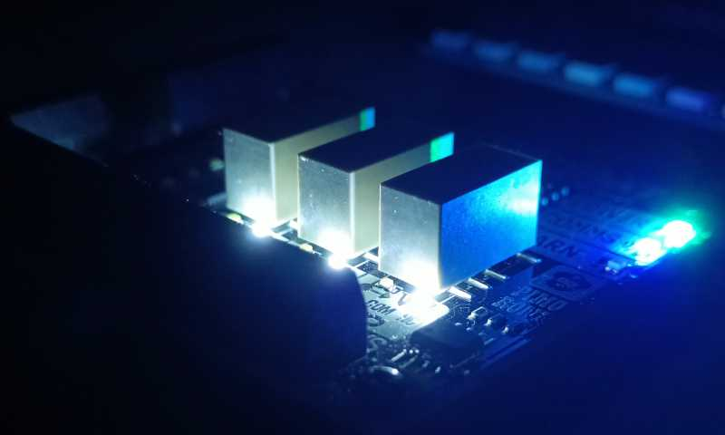

# automationphat-mqtt
Reads Automation pHAT ADC inputs and GPIO IOs and sends it to MQTT server.
Allows controlling outputs via MQTT.
Requires and relies heavily on 
[pimoroni/automation-hat libraries](https://github.com/pimoroni/automation-hat).
Enables (easy?) integration to for example Home Assistant.



## Suggested hardware:  
Pretty much any Raspberry Pi will do with Raspberry OS (former Raspbian). 

And one of the pHAT/HAT supported by pimoroni library:
- Pimoroni [Automation pHAT](https://pinout.xyz/pinout/automation_phat) (discontinued). 
- As automation pHAT is disconued, i also added support for 
[Automation HAT](https://shop.pimoroni.com/products/automation-hat)
which i have.

- Latest
[Automation HAT Mini](https://shop.pimoroni.com/products/automation-hat-mini)
should also be partly supported, but i haven't tested it.

## Usage
Pimoroni library uses smbus to detect board type so this script need it too. Enable it if you haven't already:  
``sudo raspi-config`` -> ``Interfacing options`` -> ``P5 I2C`` -> enable -> restart

Create python venv if desired. Clone the repository. 
Copy automationphat-mqtt.conf.example to automationphat-mqtt.conf
and modify as needed. Install requirements from requirements.txt. Run.
For usage with home assistant see following example.

## Example home assistant configuration.yaml entry:
```
# Example configuration.yaml entry
mqtt:
  switch:
    - name: Automationphat output 1
      state_topic: "automationphat/output1"
      payload_off: "0"
      payload_on: "1"
      command_topic: "automationphat/output1/control"
    - name: Automationphat output 2
      state_topic: "automationphat/output2"
      payload_off: "0"
      payload_on: "1"
      command_topic: "automationphat/output2/control"
    - name: Automationphat output 3
      state_topic: "automationphat/output3"
      payload_off: "0"
      payload_on: "1"
      command_topic: "automationphat/output3/control"
    - name: Automationphat relay 1
      state_topic: "automationphat/relay1"
      payload_off: "0"
      payload_on: "1"
      command_topic: "automationphat/relay1/control"
    - name: Automationphat relay 2
      state_topic: "automationphat/relay2"
      payload_off: "0"
      payload_on: "1"
      command_topic: "automationphat/relay2/control"
    - name: Automationphat relay 3
      state_topic: "automationphat/relay3"
      payload_off: "0"
      payload_on: "1"
      command_topic: "automationphat/relay3/control"
  sensor:
    - name: Automationphat voltage 1
      state_topic: "automationphat/voltage1"
      unit_of_measurement: V
    - name: Automationphat voltage 2
      state_topic: "automationphat/voltage2"
      unit_of_measurement: V
    - name: Automationphat voltage 3
      state_topic: "automationphat/voltage3"
      unit_of_measurement: V
  binary_sensor:
    - name: Automationphat input 1
      state_topic: "automationphat/input1"
      payload_on: 1
      payload_off: 0
    - name: Automationphat input 2
      state_topic: "automationphat/input2"
      payload_on: 1
      payload_off: 0
    - name: Automationphat input 3
      state_topic: "automationphat/input3"
      payload_on: 1
      payload_off: 0


## Example home assistant configuration.yaml entry - the old way:
```
# Example configuration.yaml entry
sensor:
  - platform: mqtt
    name: Automationphat voltage 1
    state_topic: "automationphat/voltage1"
    unit_of_measurement: V
  - platform: mqtt
    name: Automationphat voltage 2
    state_topic: "automationphat/voltage2"
    unit_of_measurement: V
  - platform: mqtt
    name: Automationphat voltage 3
    state_topic: "automationphat/voltage3"
    unit_of_measurement: V

binary_sensor:
  - platform: mqtt
    name: Automationphat input 1
    state_topic: "automationphat/input1"
    payload_on: 1
    payload_off: 0
  - platform: mqtt
    name: Automationphat input 2
    state_topic: "automationphat/input2"
    payload_on: 1
    payload_off: 0
  - platform: mqtt
    name: Automationphat input 3
    state_topic: "automationphat/input3"
    payload_on: 1
    payload_off: 0

switch:
  - platform: "mqtt"
    name: Automationphat output 1
    state_topic: "automationphat/output1"
    payload_off: "0"
    payload_on: "1"
    command_topic: "automationphat/output1/control"
  - platform: "mqtt"
    name: Automationphat output 2
    state_topic: "automationphat/output2"
    payload_off: "0"
    payload_on: "1"
    command_topic: "automationphat/output2/control"
  - platform: "mqtt"
    name: Automationphat output 3
    state_topic: "automationphat/output3"
    payload_off: "0"
    payload_on: "1"
    command_topic: "automationphat/output3/control"
  - platform: "mqtt"
    name: Automationphat relay 1
    state_topic: "automationphat/relay1"
    payload_off: "0"
    payload_on: "1"
    command_topic: "automationphat/relay1/control"
  - platform: "mqtt"
    name: Automationphat relay 2
    state_topic: "automationphat/relay2"
    payload_off: "0"
    payload_on: "1"
    command_topic: "automationphat/relay2/control"
  - platform: "mqtt"
    name: Automationphat relay 3
    state_topic: "automationphat/relay3"
    payload_off: "0"
    payload_on: "1"
    command_topic: "automationphat/relay3/control"
```
